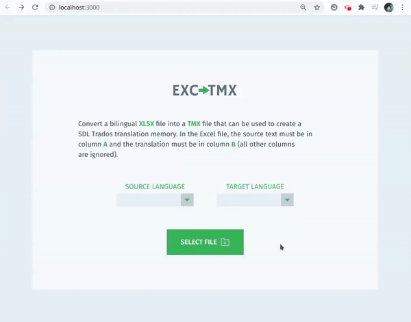

<h1 align="center">EXCtoTMX</h1>

This is the **frontend** part for simple project **EXCtoTMX** developed in **TypeScript** and **React.js**. This minimal app converts a bilingual **.xlsx** file into a **TMX** file to be imported into translation software (CAT tools).

**TMX** is a type of XML file that contains translation units (source text and corresponding translations) and can be imported into **translation memories** from CAT (computer-assisted translation) software. A translation memory is a database of translations which is populated as translators translate source files.

## Motivation

Having worked as a translator for many years, I often found myself in a situation where I had an Excel file with existing translations that could be reused in another translation project, so I needed to generate a TMX file to import these existing translations into the translation editor and avoid having to re-type or copy and paste each translation unit.

## How it works

The TMX file is a XML file that follows a common structure, so this app basically allows you upload a bilingual .xlsx file (containing source text in column A and corresponding translations in column B). It then reads the .xlsx, generates an array of `[source, translation]` tuples, then maps it into the proper XML translation units. The app then combines all translations units into one single big string, which is used to generate the TMX file on the frontend.

The frontend also does some validation, **showing an error** if:

- File is not a .xlsx file (checks the extension as well as the MIME type of the updloaded file)
- A source and target language is not selected
- Source and target languages are the same (they must be different)

## Frontend Dependencies

The frontend is built in **TypeScript** with **React.js**. It implements **axios** to call the API and upload the .xlsx file. It uses **styled-components** for styling and also **react-icons**.
